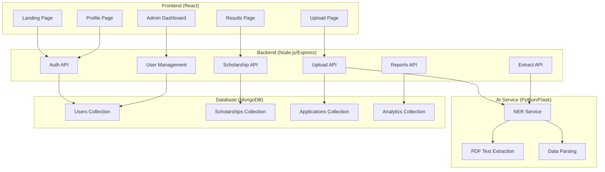

# DreamFund Platform - Codebase Analysis

## Overview

DreamFund is a comprehensive scholarship matching platform that leverages AI technology to extract student information from academic documents and match them with suitable scholarship opportunities. The platform serves both students seeking scholarships and administrators managing the scholarship database.

## System Architecture

The application follows a microservices architecture with three main components:

### Architecture Diagram



## Core Components

### 1. Frontend (React Application)

**Location**: `client/`

#### Key Features:
- **Responsive Design**: Built with React and TailwindCSS for modern, mobile-friendly interface
- **Authentication**: JWT-based authentication with OTP login for students
- **File Upload**: Drag-and-drop interface for document uploads (PDF, DOC, DOCX, images)
- **Real-time Feedback**: Progress indicators and success/error messaging
- **Admin Interface**: Separate dashboard for scholarship and user management

#### Main Pages:
- **`LandingPage.js`**: Marketing page with hero section, features, and navigation
- **`UploadPage.js`**: Document upload interface with AI extraction results
- **`ProfilePage.js`**: User profile management and manual data entry
- **`ResultsPage.js`**: Scholarship matching results with application tracking
- **`AdminLogin.js`**: Administrative access point
- **`ScholarshipManagement.js`**: CRUD operations for scholarships
- **`UserManagement.js`**: User oversight and analytics

#### Key Components:
- **`OTPLogin.js`**: Multi-step OTP authentication component
- **`ProtectedRoute.js`**: Route protection for authenticated/admin users
- **`AdminLayout.js`**: Sidebar layout with resizable navigation
- **`FeedbackBanner.js`**: Post-application feedback collection

#### Context Management:
- **`AuthContext.js`**: Handles authentication state, JWT tokens, and user data
- **`ScholarshipContext.js`**: Manages scholarship data fetching, matching, and CRUD operations

### 2. Backend (Express.js Server)

**Location**: `server/`

#### API Structure:
- **Authentication Routes** (`/api/auth`): Registration, login, profile management
- **Scholarship Routes** (`/api/scholarships`): CRUD operations, matching algorithm
- **Upload Routes** (`/api/upload`): File handling and storage
- **Extract Routes** (`/api/extract`): Communication with AI service
- **User Routes** (`/api/users`): User management for admins
- **Reports Routes** (`/api/reports`): Analytics and reporting
- **Click Tracking** (`/api/clicks`): User interaction analytics

#### Key Models:
- **`User.js`**: User schema with profile data, authentication fields
- **`Scholarship.js`**: Scholarship schema with requirements, provider info
- **`ScholarshipClick.js`**: Analytics tracking for scholarship interactions
- **`OTP.js`**: Temporary OTP storage for authentication

#### Services:
- **`emailService.js`**: SMTP-based email sending (OTP codes, notifications)
- **`scholarshipScraper.js`**: External scholarship data scraping

#### Middleware:
- **`auth.js`**: JWT token verification and user extraction
- **`adminAuth.js`**: Admin role validation

### 3. AI Extraction Service (Python)

**Location**: `extraction-service/`

#### Functionality:
- **PDF Processing**: Uses PyMuPDF to extract text from uploaded documents
- **Named Entity Recognition**: Regex-based extraction of student information
- **Data Validation**: Confidence scoring for extracted data

#### Key Functions:
- **`extract_text_from_pdf()`**: PDF text extraction
- **`extract_name()`**: Student name identification with fallback patterns
- **`extract_cgpa()`**: GPA extraction from transcripts
- **`extract_program()`**: Academic program/major detection

#### API Endpoints:
- **`/health`**: Service health check
- **`/api/extract`**: Main extraction endpoint accepting file paths

## Data Flow

### Student Journey:

1. **Registration/Login**: Student creates account or logs in via OTP
2. **Document Upload**: Files uploaded to Express server, stored in `uploads/` directory
3. **AI Processing**: Server calls Python service with file path, receives extracted data
4. **Profile Update**: Extracted data automatically updates user profile
5. **Matching Algorithm**: User profile compared against scholarship database
6. **Results Display**: Matched scholarships shown with eligibility reasons
7. **Application**: Student clicks "Apply Now", redirected to provider website
8. **Feedback**: Post-application feedback collected for platform improvement

### Admin Workflow:

1. **Admin Login**: Special credentials for administrative access
2. **Scholarship Management**: Add/edit/delete scholarships in database
3. **User Oversight**: Monitor user activity and engagement
4. **Analytics**: Review application success rates and platform usage
5. **Reports**: Generate insights from click tracking and feedback data

## Key Technologies

### Frontend Technologies:
- **React 18**: Component-based UI framework
- **React Router**: Client-side routing
- **Axios**: HTTP client for API communication
- **TailwindCSS**: Utility-first CSS framework
- **React Icons**: Icon library

### Backend Technologies:
- **Express.js**: Web application framework
- **MongoDB**: NoSQL document database
- **Mongoose**: MongoDB object modeling
- **JWT**: JSON Web Tokens for authentication
- **bcryptjs**: Password hashing
- **Multer**: File upload handling
- **Nodemailer**: Email service integration
- **Helmet**: Security middleware
- **CORS**: Cross-origin resource sharing

### AI Service Technologies:
- **Flask**: Python web framework
- **PyMuPDF**: PDF text extraction
- **spaCy** (requirements include spacy): NLP processing (though not actively used in current code)
- **Pillow**: Image processing
- **Tesseract**: OCR for image-based documents

### Development Tools:
- **Nodemon**: Development server with auto-restart
- **Shell Scripts**: Service startup/shutdown automation
- **Environment Configuration**: Separate `.env` files for different services

## Database Schema

### Users Collection:
```javascript
{
  _id: ObjectId,
  name: String,
  email: String,
  password: String (hashed),
  role: String ("user" | "admin"),
  profile: {
    gpa: Number,
    program: String,
    major: String,
    university: String,
    age: Number,
    financialNeed: String,
    extracurriculars: Array,
    achievements: Array
  },
  createdAt: Date,
  updatedAt: Date
}
```

### Scholarships Collection:
```javascript
{
  _id: ObjectId,
  title: String,
  description: String,
  amount: Number,
  deadline: Date,
  requirements: {
    minGPA: Number,
    maxAge: Number,
    majors: Array,
    financialNeed: String
  },
  eligibleCourses: Array,
  provider: {
    name: String,
    website: String,
    contact: String
  },
  status: String ("active" | "inactive"),
  createdAt: Date,
  updatedAt: Date
}
```

### Applications Collection:
```javascript
{
  _id: ObjectId,
  userId: ObjectId,
  scholarshipId: ObjectId,
  status: String ("applied" | "pending"),
  appliedAt: Date
}
```

## Security Features

- **JWT Authentication**: Token-based authentication with 7-day expiration
- **Password Hashing**: bcrypt with salt rounds
- **CORS Configuration**: Restricted origins for API access
- **File Upload Validation**: Type and size restrictions
- **Admin Role Protection**: Separate authentication for administrative functions
- **Input Validation**: Server-side validation for all user inputs

## Deployment Architecture

The application requires three services running simultaneously:

1. **Frontend**: `npm start` (Port 3000)
2. **Backend**: `npm start` (Port 5000)
3. **AI Service**: `python ner_service.py` (Port 5001)

### Environment Variables Required:

**Server (.env)**:
```
PORT=5000
MONGODB_URI=mongodb://localhost:27017/dreamfund
JWT_SECRET=your-secret-key
UPLOAD_PATH=./uploads
MAX_FILE_SIZE=10485760
```

**Client (.env)**:
```
REACT_APP_API_URL=http://localhost:5000
REACT_APP_EXTRACTION_URL=http://localhost:5001
```

## Key Algorithms

### Scholarship Matching Logic:
The matching algorithm compares user profile against scholarship requirements:
- GPA comparison with minimum requirements
- Program/major matching against eligible courses
- Age restrictions validation
- Financial need compatibility

### AI Text Extraction:
- **Name Extraction**: Regex patterns for "NAME" fields and common name formats
- **GPA Extraction**: Decimal number patterns (2.0-4.0 range)
- **Program Extraction**: Keyword matching for diploma/degree mentions

## Analytics and Tracking

- **Click Tracking**: Records scholarship link clicks for engagement analysis
- **Application Tracking**: Monitors application submissions
- **Feedback Collection**: Post-interaction surveys for platform improvement
- **Session Utils**: Local storage management for user experience continuity

## Future Enhancements

Based on code analysis, potential improvements include:
- Enhanced AI models for better text extraction accuracy
- Machine learning for improved scholarship matching
- Integration with external scholarship APIs
- Advanced analytics dashboard
- Mobile application development
- Multi-language support for international students

## Conclusion

DreamFund represents a well-architected scholarship matching platform that effectively combines modern web technologies with AI-powered document processing. The separation of concerns between frontend, backend, and AI services allows for scalable development and maintenance. The platform successfully addresses the challenge of connecting students with appropriate scholarships through intelligent document analysis and personalized matching algorithms.